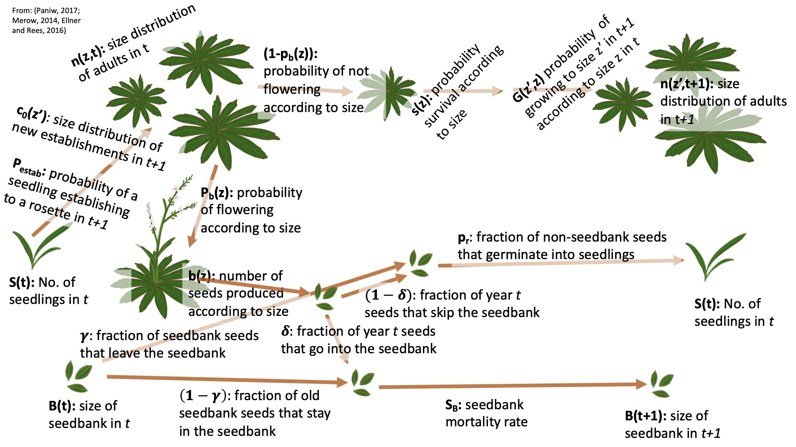

```{r setup, include=FALSE}
knitr::opts_chunk$set(echo = TRUE)
```

```{r, include=FALSE}
#load packages
library(tidyverse)
```
# Background
### *Oenothera coloradensis* life-cycle diagram


### Functions in the IPM kernel
For data from a pre-reproductive census, with a discrete seedling and seedbank stages 


**Distribution of size of individuals in year *t+1*:**
New recruits from the seedling stage + growth and survival kernel
$$n(z',t+1) = S(t)p_{estab}c_o(z') + \int_{L}^{U}(1-p_b(z))s(z)G(z',z)n(z,t)dz $$
**Size of the seedling stage:**
$$S(t+1) = p_r\Big[\gamma B(t) + (1-\delta)\int_{L}^{U}p_b(z)b(z)n(z,t)dz\Big] $$

**Seedbank:**  (after Ellner, 2016)
$$B(t+1) = s_{B}\Big[(1-\gamma)B(t)+\delta\int_{L}^{U}p_b(z)b(z)n(z,t)dz \Big]$$

# Load *Oenothera coloradensis* census data
```{r}
# load spatialized data, which we'll need for neighborhood calculations
load("../Processed_Data/spatial_COBP.RData")
dat <- butterfly
# dat <- read.csv("../Raw Data/COBP_long_CURRENT.csv")
```
## transform the necessary variables
```{r}
#### make log-transformed size variables ####
dat$log_LL_t <- log(dat$LongestLeaf_cm)
dat$log_LL_tplus1 <- log(dat$longestLeaf_tplus1)
dat$log_LL_tminus1 <- log(dat$longestLeaf_tminus1)

#### round seed count numbers (that were modeled based on regression) to whole numbers ####
dat$Num_capsules <- round(dat$Num_capsules, digits = 0)
```

# Calculate local neighborhood density
```{r}
# use plantTracker package
library(plantTracker)
# make a column that has 'trackID' data
dat$trackID <- paste0(dat$Plot_ID,"_",dat$ID)
dat$Species <- "OENCOL"

## calculate neighbors w/in a 10cm radius
dat_1 <- plantTracker::getNeighbors(dat = dat, buff = 10, method = "count", compType = "oneSpp", quad = "Plot_ID")
## rename column to indicate radius
names(dat_1)[6] <-"neighbors_10"

## calculate neighbors w/in a 5 cm radius
dat_2 <- plantTracker::getNeighbors(dat = dat_1, buff = 5, method = "count", compType = "oneSpp", quad = "Plot_ID")
## rename column to indicate radius
names(dat_2)[6] <-"neighbors_5"

## calculate neighbors w/in a 15 cm radius
dat_3 <- plantTracker::getNeighbors(dat = dat_2, buff = 15, method = "count", compType = "oneSpp", quad = "Plot_ID")
## rename column to indicate radius
names(dat_3)[6] <-"neighbors_15"

dat <- dat_3
```

Figure out which neighborhood radius makes the most sense, i.e. explains the most variation in growth and survival
```{r}

```


## other potential covariates from the data
Invertebrate leaf herbivory, stem herbivory, leaf spots (unknown source?)

# Make vital rate models 
### Survival 
$$s(z)$$
```{r}
## subset the data to exclude flowering individuals
survDat <- dat[dat$flowering==0 | is.na(dat$flowering),]

# ## visualize the data
# plot(survives_tplus1 ~ log_LL_t, data = survDat)

## logistic glm with log-transformed size_t
survMod <- glm(survives_tplus1 ~ log_LL_t, data = survDat, family = binomial)
summary(survMod)
## plot model results 
plot(survives_tplus1 ~ log_LL_t, data = survDat)
newdata <- data.frame("log_LL_t" = seq(from = min(survDat$log_LL_t, na.rm = TRUE), 
               to = max(survDat$log_LL_t, na.rm = TRUE),
               length.out = 100))
lines(x = newdata$log_LL_t, y = predict(object = survMod, newdata =  newdata, type = "response"), col = "red")
```

### Growth
$$G(z',z)$$
```{r}
# ## visualize the data
# plot(log_LL_tplus1 ~ log_LL_t, data = dat)

## lm w/ log-transformed size_t and size_t+1
sizeMod <- lm(log_LL_tplus1 ~ log_LL_t , data = dat)
summary(sizeMod)
## plot model results
plot(log_LL_tplus1 ~ log_LL_t, data = dat)
abline(sizeMod, col = "red")
```

### Number of seeds produced, according to plant size
$$b(z)$$
using size in current year (no. of seeds/plant, for those that flowered ~ size_t)
```{r}
 ## use only plants that flowered 
 seedDat <- dat[dat$flowering==1,]

# ## visualize the data
# plot(Num_capsules ~ log_LL_t, data = seedDat)

## fit poisson glm (for count data)
seedMod_t <- glm(Num_capsules ~ log_LL_t, data = seedDat, family = poisson)
summary(seedMod_t)
## plot model results
plot(Num_capsules ~ log_LL_t, data = seedDat)
newdata <- data.frame("log_LL_t" = seq(from = min(seedDat$log_LL_t, na.rm = TRUE), 
                                       to = max(seedDat$log_LL_t, na.rm = TRUE),
                                       length.out = 100))
lines(x = newdata$log_LL_t, y = predict(object = seedMod_t, newdata =  newdata, type = "response"), col = "red")
```

### Flowering probability
$$p_b(z)$$
using size in current year (w/ squared term)
```{r}
## logistic glm with log-transformed size_t
flwrMod_t <- glm(flowering ~ log_LL_t + I(log_LL_t^2), data = dat, family = binomial)
summary(flwrMod_t)
## plot model results 
plot(flowering ~ log_LL_t, data = dat)
newdata <- data.frame("log_LL_t" = seq(from = min(dat$log_LL_t, na.rm = TRUE), 
                                       to = max(dat$log_LL_t, na.rm = TRUE),
                                       length.out = 100))
lines(x = newdata$log_LL_t, y = predict(object = flwrMod_t, newdata =  newdata, type = "response"), col = "red")
```

### Distribution of recruit size 
$$c_o(z')$$
```{r}
## subset the data
recD <- dat[dat$age == 0 & is.na(dat$age) == FALSE,]

recMod <- lm(log_LL_t ~ 1, data = recD)
summary(recMod)

hist(recD$log_LL_t)
abline(v = recMod$coefficients, col = "blue", lwd = 2)
```

### Probability of a seedling in year *t* establishing to a rosette in year *t+1*
$$p_{estab}$$
```{r message=FALSE}
## make a column in 'dat' that labels 'recruits' to the rosette stage
dat$recruit <- 0
dat[dat$age==0 & is.na(dat$age)==FALSE,"recruit"] <- 1
## get the number of recruits/year 
estabTemp <- dat %>% 
  select(Plot_ID, Year, recruit) %>% 
  group_by(Plot_ID, Year) %>% 
  summarize( recruits = sum(recruit)) %>% 
  rename( recruits_t = recruits)
  
## change the 2018 recruit values to NA, since we don't have a count of recruits to the rosette stage for that year
estabTemp[estabTemp$Year==2018, "recruits_t"] <- NA
## get the number of recruits in year t+1
estabTemp$Year <- estabTemp$Year - 1
names(estabTemp)[3] <- "recruits_tplus1"

## get the no.of seedlings/year
## load the seedling data
seedlings <- read.csv("../Raw Data/COBP_seedlings_8_23_21.csv") %>% 
  select(Plot_ID, Seedlings_18, Seedlings_19, Seedlings_20) %>% 
  group_by(Plot_ID) %>% 
  summarize(Seedlings_18 = sum(Seedlings_18), Seedlings_19 = sum(Seedlings_19), Seedlings_20 = sum(Seedlings_20)) %>% 
  pivot_longer(cols = c(Seedlings_18, Seedlings_19, Seedlings_20), names_to = "Year", values_to = "Seedlings_t", names_pattern = "([[:digit:]]+)") %>% 
  mutate(Year = (as.numeric(Year) + 2000))

## combine seedling and rosette recruit data
estabs <- left_join(estabTemp, seedlings)

## increase the number of seedlings by 10% (to conservatively account for missed seedlings or ones that germinated later in the year)
#estabs$Seedlings_t <- round(1.10 * estabs$Seedlings_t,0)
## calculate the probability of seedling in year t establishing to a rosette in year t+1
estabs$P_estab <- estabs$recruits_tplus1/estabs$Seedlings_t

estabs[is.infinite(estabs$P_estab),"P_estab"] <- NA
## if the value is >1, round back to one (must have missed some seedlings)
estabs[estabs$P_estab > 1 & is.na(estabs$P_estab) == FALSE,"P_estab"] <- 1

estabs <- as.data.frame(estabs)
p.estab.est <- sum(estabs$P_estab, na.rm = TRUE)/sum(is.na(estabs$P_estab)==FALSE)
```

### Probability of a seed produced by an adult plant in year t will enter the seedbank
$$\delta$$

```{r}
delta.est <- .5
```

### Probability that non-seedbank seeds will germinate into seedlings in year t+1
$$p_r$$
```{r}
p.r.est <- .5
```

### Probability that a seed in the seedbank in year t will exit the seedbank in year t+1 
$$\gamma$$
```{r}
gamma.est <- .5
```


### Probability that a seed in the seedbank in year t will survive and be in the seedbank in year t+1 
$$s_b$$
```{r}
s.b.est <- .5
```


## Implement the IPM 
use ipmr to fit the IPM
```{r}
library(ipmr)

# Set up the initial population conditions and parameters (example w/ only one discrete stage and dummy seedbank rates)
data_list <- list(
  g_int     = coef(sizeMod)[1],
  g_slope   = coef(sizeMod)[2],
  g_sd      = summary(sizeMod)$sigma,
  s_int     = coef(survMod)[1],
  s_slope   = coef(survMod)[2],
  p_b_int   = coef(flwrMod_t)[1], #probability of flowering
  p_b_slope = coef(flwrMod_t)[2],
  p_b_slope_2 = coef(flwrMod_t)[3],
  b_int   = coef(seedMod_t)[1], #seed production
  b_slope = coef(seedMod_t)[2],
  c_o_mu    = coef(recMod), #recruit size distribution
  c_o_sd    = summary(recMod)$sigma,
  p_r   = p.r.est, # Probability that non-seedbank seeds will germinate into seedlings in year t+1
  gamma = gamma.est, # Probability that a seed in the seedbank in year t will exit the seedbank in year t+1 
  delta = delta.est, # probability that a seed produced by an adult plant in year t will enter the seedbank
  s_b = s.b.est, # probability that a seed in the seedbank in year t will survive and be in the seedbank in year t+1
  p_estab = p.estab.est # probability that a seedling will establish into a rosette in t+1
)

## Next, we set up two functions to pass into the model. These perform the inverse logit transformations for the probability of flowering model (r_r/𝑟𝑟(𝑧)).

# We'll set up some helper functions. The survival function
# in this model is a quadratic function, so we use an additional inverse logit function
# that can handle the quadratic term.

inv_logit <- function(int, slope, sv) {
  1/(1 + exp(-(int + slope * sv)))
}

inv_logit_2 <- function(int, slope, slope_2, sv) {
  1/(1 + exp(-(int + slope * sv + slope_2 * sv ^ 2)))
}
## Now, we’re ready to begin making the IPM kernels. We change the sim_gen argument of init_ipm() to "general".

general_ipm <- init_ipm(sim_gen = "general", # make a general IPM
                        di_dd = "di", # make it density independent
                        det_stoch = "det") %>% # make it deterministic
  define_kernel(
    name          = "P",
    
    # We add d_ht to formula to make sure integration is handled correctly.
    # This variable is generated internally by make_ipm(), so we don't need
    # to do anything else.
    
    formula       = (1-p_b.) * s. * g. * d_ht,
    
    
    family        = "CC",
    
    
    g.             = dnorm(ht_2, g_mu, g_sd),
    g_mu          = g_int + g_slope * ht_1,
    s.             = inv_logit(s_int, s_slope, ht_1),
    p_b.          = inv_logit_2(p_b_int, p_b_slope, p_b_slope_2, ht_1),
    data_list     = data_list,
    states        = list(c('ht')),
    uses_par_sets = FALSE,
    evict_cor     = FALSE
    #evict_fun     = truncated_distributions('norm', 'g')
) %>%
  define_kernel(
    name          = "leave_seedlings", ## leave seedling stage and go to rosette stage
    formula       = p_estab. * c_o. ,
    
    # Note that now, family = "DC" because it denotes a discrete -> continuous transition
    
    family        = 'DC',
    p_estab.      = p_estab,
    c_o.          = dnorm(ht_2, c_o_mu, c_o_sd),
    data_list     = data_list,
    
    # Note that here, we add "s" to our list in states, because this kernel uses seedlings 
    
    states        = list(c('ht', "s")),
    uses_par_sets = FALSE,
    evict_cor     = FALSE
    #evict_fun     = truncated_distributions('norm','g')
) %>%
  define_kernel(
    name    = "repro_to_seedlings",
   
    formula       = (p_r. * (1-delta.)) * (p_b. * b. * d_ht),
    
    # The family argument tells ipmr what kind of transition this kernel describes.
    # it can be "CC" for continuous -> continuous, "DC" for discrete -> continuous
    # "CD" for continuous -> discrete, or "DD" for discrete -> discrete.
    
    family        = "CD",
    
    p_r.          = p_r,
    delta.        = delta,
    p_b.          = inv_logit_2(p_b_int, p_b_slope, p_b_slope_2, ht_1),
    b.            = exp(b_int + b_slope * ht_1),
    data_list     = data_list,
    states        = list(c('ht', 's')),
    uses_par_sets = FALSE,
    evict_cor     = FALSE
    #evict_fun     = truncated_distributions('norm', 'g')

) %>%
  define_kernel(
    
    name          = 'seedbank_to_seedlings',
    
    formula       = p_r. * gamma.,
    
    # Note that now, family = "DC" because it denotes a discrete -> continuous transition
    
    family        = 'DD',
    p_r.          = p_r, 
    gamma.        = gamma,
    p_estab       = p_estab,
    data_list     = data_list,
    
    # Note that here, we add "s" to our list in states, because this kernel uses seedlings, and 'b', since this kernel using the seedbank stage
    
    states        = list(c('b', 's')),
    uses_par_sets = FALSE
    
  ) %>%
  define_kernel(
    name    = "stay_seedbank",
   
    formula       = (1 - gamma.) * s_b. ,
    
    # The family argument tells ipmr what kind of transition this kernel describes.
    # it can be "CC" for continuous -> continuous, "DC" for discrete -> continuous
    # "CD" for continuous -> discrete, or "DD" for discrete -> discrete.
    
    family        = "DD",
    
    gamma.        = gamma,
    s_b.          = s_b,
    data_list     = data_list,
    states        = list(c('b')),
    uses_par_sets = FALSE
    
  ) %>%
  define_kernel(
    
    name          = 'repro_to_seedbank',
    
    formula       = (s_b. * delta.) * (p_b. * b. * d_ht),
    
    family        = 'CD',
    s_b.          = s_b, 
    delta.        = delta,
    p_b.          = inv_logit_2(p_b_int, p_b_slope, p_b_slope_2, ht_1),
    b.            = exp(b_int + b_slope * ht_1),
    data_list     = data_list,
    
    # Note that here, we add "s" to our list in states, because this kernel uses seedlings, and 'b', since this kernel using the seedbank stage
    
    states        = list(c('b', 'ht')),
    uses_par_sets = FALSE,
    evict_cor     = FALSE
    #evict_fun     = truncated_distributions(fun = 'norm', target = 'p_b')
) 
## We’ve now defined all of the kernels, next are the implementation details. These also differ somewhat from simple IPMs. The key difference in the implementation arguments list lies in the state_start and state_end of each kernel, and is related to the family argument of each kernel. Kernels that begin with one state and end in a different state (e.g. moving from seed bank to a plant) will have different entries in the state_start and state_end slots. It is very important to get these correct, as ipmr uses this information to generate the model iteration procedure automatically (i.e. code corresponding to Equations 1-2).

# general_ipm <- general_ipm %>%
#   define_impl(
#     list(
#       P                     = list(int_rule    = "midpoint",
#                                    state_start = "ht",
#                                    state_end   = "ht"),
#       leave_seedlings       = list(int_rule    = "midpoint",
#                                    state_start = "s",
#                                    state_end   = "ht"),
#       repro_to_seedlings    = list(int_rule    = "midpoint",
#                                    state_start = "ht",
#                                    state_end   = "s"),
#       seedbank_to_seedlings = list(int_rule    = "midpoint",
#                                    state_start = "b",
#                                    state_end   = "s"),
#       stay_seedbank         = list(int_rule    = "midpoint",
#                                    state_start = "b",
#                                    state_end   = "b"),
#       repro_to_seedbank     = list(int_rule    = "midpoint",
#                                    state_start = "ht",
#                                    state_end   = "b")
#       )
#     )

## alternative method
general_ipm <- general_ipm %>%
  define_impl(
    make_impl_args_list(
      kernel_names = c("P", "leave_seedlings", "repro_to_seedlings", "seedbank_to_seedlings", "stay_seedbank", "repro_to_seedbank"),
      int_rule     = c(rep("midpoint", 6)),
      state_start    = c('ht', "s", "ht", "b", "b", "ht"),
      state_end      = c("ht", "ht", "s", "s", "b", "b")
    )
  )
```
Actually run the IPM!
```{r}
# lower limit of size
L <- 1.09
# upper limit of size
U <- 3.66

n <- 500

set.seed(2312)

init_pop_vec   <- runif(500)

init_seed_bank <- 20

init_seedlings <- round(sum(seedlings$Seedlings_t)/length(seedlings$Seedlings_t),0)

general_ipm <- general_ipm %>%
  define_domains(
    
    # We can pass the variables we created above into define_domains
    
    ht = c(L, U, n)
    
  ) %>%
  define_pop_state(
    
    # We can also pass them into define_pop_state
    
    pop_vectors = list(
      n_ht = init_pop_vec,
      n_b  = init_seed_bank,
      n_s  = init_seedlings 
    )
  ) %>%
  make_ipm(iterations = 100,
           usr_funs = list(inv_logit   = inv_logit,
                           inv_logit_2 = inv_logit_2), return_main_env = TRUE )


# lambda is a generic function to compute per-capita growth rates. It has a number
# of different options depending on the type of model

lambda(general_ipm)

# If we are worried about whether or not the model converged to stable
# dynamics, we can use the exported utility is_conv_to_asymptotic. The default
# tolerance for convergence is 1e-10, but can be changed with the 'tol' argument.

is_conv_to_asymptotic(general_ipm, tol = 1e-10)


lambda_ipmr <- lambda(general_ipm)
repro_value <- left_ev(general_ipm)
stable_dist <- right_ev(general_ipm)
```


### Visualize the IPM kernel
```{r}
## make an image of the IPM
## first have to make a mega-kernel?
mega_mat <- make_iter_kernel(ipm = general_ipm, 
                             mega_mat = c(seedbank_to_seedlings, repro_to_seedlings, stay_seedbank, repro_to_seedbank,  leave_seedlings, P))

Re(eigen(mega_mat[[1]])$values[1]) - lambda(general_ipm)


## define the meshpoints
meshpts <- seq(from = L, to = U, length = 500)


## get the n(z',t) kernel 
K <- right_mult(general_ipm$sub_kernels$P, general_ipm$pop_state$n_ht) + right_mult(general_ipm$sub_kernels$leave_seedlings, general_ipm$pop_state$n_s)
## get the seedling vector
Seedling_vec <- right_mult(general_ipm$sub_kernels$repro_to_seedlings, general_ipm$pop_state$n_ht) + right_mult(general_ipm$sub_kernels$seedbank_to_seedlings, general_ipm$pop_state$n_b) 
## get the seedbank vector
Seedbank_vec <- right_mult(general_ipm$sub_kernels$stay_seedbank, general_ipm$pop_state$n_b) + right_mult(general_ipm$sub_kernels$repro_to_seedbank,  general_ipm$pop_state$n_ht) 

plot(x = meshpts, 
     y = meshpts,
     ipm = K,
  #mega_mat = c(stay_seedbank, repro_to_seedbank,  seedbank_to_seedlings, repro_to_seedlings,leave_seedlings, P),
  col = rainbow(100, start = 0.67, end = 0),
  bw = FALSE,
  do_contour = TRUE,
  do_legend = FALSE,
  exponent = 1
)

image(t(K)^.1)
```

