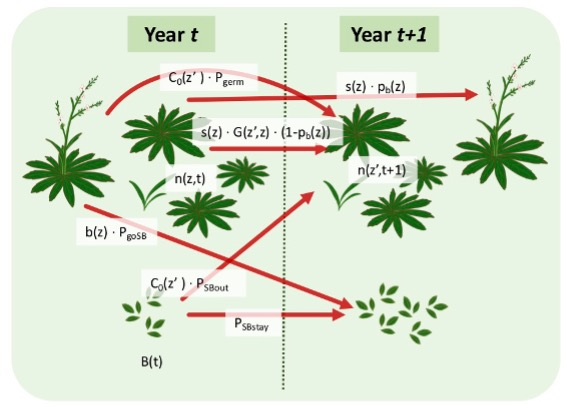

```{r setup, include=FALSE}
knitr::opts_chunk$set(echo = TRUE)
```

```{r, include=FALSE}
#load packages
library(tidyverse)
```
# Background
### *Oenothera coloradensis* life-cycle diagram

### Functions in the IPM kernel
With a time lag for flowering (influenced by size in year t-1 rather than year 1) and a discrete seedbank stage
$n(z',t+1) = $

**Fecundity:**
$$\int_{L}^{U}(1-p_b(z))s(z)G(z',z)n(z,t)dz$$
plus ... 

**Growth:**
$$C_0(z') \Big[ p_{germ}\int_{L}^{U}p_b(z)n(z,t-1)dz+p_{SBout}B(t) \Big] $$

**Seedbank:**   
$$B(t+1) = p_{SBstay}B(t)+p_{goSB}\int_{L}^{U}p_b(z)b(z)n(z,t)dz$$

where...

$n(z’,t+1)$ = the distribution of indivdiauls of size *z* in time *t+1*   
$z$ = the distribution of plant size in year *t*    
$z’$ = distribution of plant size in year *t+1*   
$p_b(z)$ = probability of reproduction as a function of size *z*   
$s(z)$ = probability of survival as a function of size *z*    
$G(z’,z)$ = kernel that determines the distribution of size in year *t+1* (*z’*) as a function of size in year *t* (*z*)   
$C_0(z’)$ = size distribution of new recruits   
$b(z)$ = number of offspring produced per individual as a function of size *z*    
$B(t)$ = size of seedbank in year *t*   
$U$ =upper limit of plant size    
$L$ =lower limit of plant size   
$n(z,t)/n(z,t-1$) = distribution of individuals of size *z'* in year *t* (or *t-1*) as a function of size *z*   

# Load *Oenothera coloradensis* census data
```{r}
dat <- read.csv("../Raw Data/COBP_long_CURRENT.csv")
```
## transform the necessary variables
```{r}
#### make log-transformed size variables ####
dat$log_LL_t <- log(dat$LongestLeaf_cm)
dat$log_LL_tplus1 <- log(dat$longestLeaf_tplus1)
dat$log_LL_tminus1 <- log(dat$longestLeaf_tminus1)

#### round seed count numbers (that were modeled based on regression) to whole numbers ####
dat$Num_capsules <- round(dat$Num_capsules, digits = 0)
```

# Make vital rate models 
### Survival
```{r}
## subset the data to exclude flowering individuals
survDat <- dat[dat$flowering==0 | is.na(dat$flowering),]

# ## visualize the data
# plot(survives_tplus1 ~ log_LL_t, data = survDat)

## logistic glm with log-transformed size_t
survMod <- glm(survives_tplus1 ~ log_LL_t, data = survDat, family = binomial)
summary(survMod)
## plot model results 
plot(survives_tplus1 ~ log_LL_t, data = survDat)
newdata <- data.frame("log_LL_t" = seq(from = min(survDat$log_LL_t, na.rm = TRUE), 
               to = max(survDat$log_LL_t, na.rm = TRUE),
               length.out = 100))
lines(x = newdata$log_LL_t, y = predict(object = survMod, newdata =  newdata, type = "response"), col = "red")
```

### Growth
```{r}
# ## visualize the data
# plot(log_LL_tplus1 ~ log_LL_t, data = dat)

## lm w/ log-transformed size_t and size_t+1
sizeMod <- lm(log_LL_tplus1 ~ log_LL_t, data = dat)
summary(sizeMod)
## plot model results
plot(log_LL_tplus1 ~ log_LL_t, data = dat)
abline(sizeMod, col = "red")
```

### Fecundity 
using size in current year (no. of seeds/plant, for those that flowered ~ size_t)
```{r}
 ## use only plants that flowered 
 seedDat <- dat[dat$flowering==1,]

# ## visualize the data
# plot(Num_capsules ~ log_LL_t, data = seedDat)

## fit poisson glm (for count data)
seedMod_t <- glm(Num_capsules ~ log_LL_t, data = seedDat, family = poisson)
summary(seedMod_t)
## plot model results
plot(Num_capsules ~ log_LL_t, data = seedDat)
newdata <- data.frame("log_LL_t" = seq(from = min(seedDat$log_LL_t, na.rm = TRUE), 
                                       to = max(seedDat$log_LL_t, na.rm = TRUE),
                                       length.out = 100))
lines(x = newdata$log_LL_t, y = predict(object = seedMod_t, newdata =  newdata, type = "response"), col = "red")
```

### Fecundity
using size in previous year (no. of seeds/plant, for those that flowered ~ size_tminus1)
```{r}
## visualize the data
plot(Num_capsules ~ log_LL_tminus1, data = seedDat)

## fit poisson glm (for count data)
seedMod_tminus1 <- glm(Num_capsules ~ log_LL_tminus1, data = seedDat, family = poisson)
summary(seedMod_tminus1)
## plot model results
plot(Num_capsules ~ log_LL_tminus1, data = seedDat)
newdata <- data.frame("log_LL_tminus1" = seq(from = min(seedDat$log_LL_tminus1, na.rm = TRUE), 
                                       to = max(seedDat$log_LL_tminus1, na.rm = TRUE),
                                       length.out = 100))
lines(x = newdata$log_LL_tminus1, y = predict(object = seedMod_tminus1, newdata =  newdata, type = "response"), col = "red")

```

### Flowering probability
using size in current year
```{r}
## visualize the data
plot(flowering ~ log_LL_t, data = dat)

## logistic glm with log-transformed size_t
flwrMod_t <- glm(flowering ~ log_LL_t, data = dat, family = binomial)
summary(flwrMod_t)
## plot model results 
plot(flowering ~ log_LL_t, data = dat)
newdata <- data.frame("log_LL_t" = seq(from = min(dat$log_LL_t, na.rm = TRUE), 
                                       to = max(dat$log_LL_t, na.rm = TRUE),
                                       length.out = 100))
lines(x = newdata$log_LL_t, y = predict(object = flwrMod_t, newdata =  newdata, type = "response"), col = "red")
```

### Flowering probability
using size in previous year
```{r}

## visualize the data
plot(flowering ~ log_LL_tminus1, data = dat)

## logistic glm with log-transformed size_t
flwrMod_tminus1 <- glm(flowering ~ log_LL_tminus1, data = dat, family = binomial)
summary(flwrMod_tminus1)
## plot model results 
plot(flowering ~ log_LL_tminus1, data = dat)
newdata <- data.frame("log_LL_tminus1" = seq(from = min(dat$log_LL_tminus1, na.rm = TRUE), 
                                       to = max(dat$log_LL_tminus1, na.rm = TRUE),
                                       length.out = 100))
lines(x = newdata$log_LL_tminus1, y = predict(object = flwrMod_tminus1, newdata =  newdata, type = "response"), col = "red")
```

### Distribution of recruit size
```{r}
## subset the data
recD <- dat[dat$age == 0 & is.na(dat$age) == FALSE,]

recMod <- lm(log_LL_t ~ 1, data = recD)
summary(recMod)

hist(recD$log_LL_t)
abline(v = recMod$coefficients, col = "blue", lwd = 2)
```

### Probability of establishment
```{r message=FALSE}
## get the number of recruits/year and no. seeds/year
estabTemp <- dat %>% 
  select(Plot_ID, Year, Num_capsules, seedling) %>% 
  group_by(Plot_ID, Year) %>% 
  summarize(seeds = sum(Num_capsules, na.rm = TRUE), recruits = sum(seedling)) %>% 
  rename(seeds_t = seeds, recruits_t = recruits) 

seedsTemp <- estabTemp %>% 
  select(Plot_ID, Year, seeds_t)

recsTemp <- estabTemp %>% 
  select(Plot_ID, Year, recruits_t) %>% 
  rename(recruits_tplus1 = recruits_t) %>% 
  mutate(Year = Year - 1)

estabs <- left_join(seedsTemp, recsTemp)

temp <- estabs$recruits_tplus1/estabs$seeds_t
temp[is.infinite(temp)] <- NA
(p.r.est <- mean(temp, na.rm = TRUE))
```

### Probability of a seed produced by an adult plant in year t will germinate in year t+1 (i.e. skipping the seedbank) (Pgerm)

### Probability of a seed produced by an adult plant in year t will enter the seedbank in year t+1 (PgoSB)

###Probability that a seed in the seedbank in year t will exit the seedbank in year t+1 (PSBout)

### Probability that a seed in the seedbank in year t will stay in the seedbank as a viable seed in year t+1 (PSBstay)

## Note: Vital rates #1 and #2, and #3 and #4 do not need to sum to 1. The remainder of each of these pairs accounts for seed mortality between years.  


#### implement IPM ####
### fit demography functions

## Growth function, given you are size z now returns the pdf of size z1 next time

G_z1z <- function(z1, z, m.par)
{
  mu <- m.par["grow.int"] + m.par["grow.z"] * z           # mean size next year
  sig <- m.par["grow.sd"]                                    # sd about mean
  p.den.grow <- dnorm(z1, mean = mu, sd = sig)             # pdf that you are size z1 given you were size z
  return(p.den.grow)
}

## Survival function, logistic regression

s_z <- function(z, m.par)
{
  linear.p <- m.par["surv.int"] + m.par["surv.z"] * z  # linear predictor
  p <- 1/(1+exp(-linear.p))                            # logistic transformation to probability
  return(p)
}

## Probability of flowering function, logistic regression

p_bz <- function(z, m.par)
{
  linear.p <- m.par["flow.int"] + m.par["flow.z"] * z      # linear predictor
  p <- 1/(1+exp(-linear.p))                                # logistic transformation to probability
  return(p)
}

## Seed production function

b_z <- function(z, m.par)
{
  N <- exp(m.par["seed.int"] + m.par["seed.z"] * z)    # seed production of a size z plant
  return(N)
}

## Recruit size pdf

c_0z1 <- function(z1, m.par)
{
  mu <- m.par["rcsz.int"]
  sig <- m.par["rcsz.sd"]
  p.deRecr <- dnorm(z1, mean = mu, sd = sig)              # pdf of a size z1 recruit
  return(p.deRecr)
}

## Define the survival kernel
P_z1z <- function (z1, z, m.par) {
  
  return((1 - p_bz(z, m.par)) * s_z(z, m.par) * G_z1z(z1, z, m.par))
  
}

## Define the fecundity kernel
F_z1z <- function (z1, z, m.par) {
  
  return( p_bz(z, m.par) * b_z(z, m.par) * m.par["p.r"] * c_0z1(z1, m.par))
  
}

mk_K <- function(m, m.par, L, U) {
  
  # mesh points 
  h <- (U - L)/m
  meshpts <- L + ((1:m) - 1/2) * h
  P <- h * (outer(meshpts, meshpts, P_z1z, m.par = m.par))
  F <- h * (outer(meshpts, meshpts, F_z1z, m.par = m.par))
  K <- P + F
  return(list(K = K, meshpts = meshpts, P = P, F = F))
}


# flexible size limits, defaults set for Oenothera model
mk_K_ceiling <- function(m, m.par, L, U, U1 = U) {
  # mesh points 
  h <- (U - L)/m;
  meshpts <- L + ((1:m) - 1/2) * h;
  P <- h * (outer(meshpts, pmin(meshpts,U1), P_z1z, m.par = m.par));
  F <- h * (outer(meshpts, pmin(meshpts,U1), F_z1z, m.par = m.par));
  K <- P + F;
  return(list(K = K, meshpts = meshpts, P = P, F = F))
}

#Function to calculate mean and variance in reproductive output for a size z

get_mean_var_Repr <- function(init.z,n.samp) {
  
  # initial population sizes and ages
  z   <- rep(init.z,1000)
  Repr.out <- NULL
  
  repeat {
    
    ## calculate population size
    pop.size <- length(z)
    
    ## generate binomial random number for the probability of flowering, where the probability of flowering
    ## depends on your size z, this is a vector of 0's and 1's, you get a 1 if you flower
    Repr <- rbinom(n=pop.size, prob=p_bz(z, m.par.true), size=1)
    
    ## number of plants that flowered
    num.Repr <- sum(Repr)
    
    if(num.Repr>0) {
      Seeds <- rpois(num.Repr, m.par.true["p.r"] * b_z(z[Repr==1],m.par.true))
      Repr.out <- c(Repr.out,Seeds)
    }
    
    ## generate new recruit sizes
    ## rnorm generated normally distributed random numbers
    Rcsz <- rep(init.z,100)
    
    ## for the non-reproductive plants generate random number for survival
    Surv <- rep(NA, pop.size)
    Surv[Repr==0] <- rbinom(n = pop.size - num.Repr, prob = s_z(z[Repr==0], m.par.true), size = 1)
    num.die <- sum(Surv==0, na.rm=TRUE)
    
    if(num.die>0) Repr.out <- c(Repr.out,rep(0,num.die))
    
    ## index for individuals that did not flower and survived
    i.subset <- which(Repr==0 & Surv==1)
    
    ## let them grow
    E.z1 <- m.par.true["grow.int"]+m.par.true["grow.z"]*z[i.subset]
    z1 <- rnorm(n = pop.size - num.Repr - num.die, mean = E.z1, sd = m.par.true["grow.sd"])
    
    z <- c(Rcsz, z1)
    
    if(length(Repr.out)>n.samp) break
    
  }
  
  return(c(mean(Repr.out),var(Repr.out),mean(Repr.out>0),var(Repr.out>0)))
  
}

## specify coefficients from models above
## using t for flowering and fecundity
m.par.est <- c(surv = coef(survMod),
               flow = coef(flwrMod_t),
               grow = coef(sizeMod),
               grow.sd = summary(sizeMod)$sigma,
               rcsz = coef(recMod),
               rcsz.sd = summary(recMod)$sigma,
               seed = coef(seedMod_t),
               p.r = p.r.est
               )
names(m.par.est) <- c("surv.int", "surv.z", "flow.int", "flow.z",  "grow.int", "grow.z",   "grow.sd" , "rcsz.int", "rcsz.sd" , "seed.int", "seed.z"  , "p.r"   )  

 
nBigMatrix <- 250
min.size <- with(dat, min(log_LL_t, na.rm = TRUE))
min.size
max.size <- with(dat, max(log_LL_t, na.rm = TRUE))
max.size


IPM.est <- mk_K(nBigMatrix, m.par.est, -3, 4)

## visualize kernel
matrix.image(A = IPM.est$K, x = IPM.est$meshpts, y = IPM.est$meshpts)


Re(eigen(IPM.est$K)$values[1])
## modeled asymptotic rate of increase : 0.999

pop.size <- dat %>% 
  select(Year, log_LL_t) %>% 
  group_by(Year) %>% 
  summarize(pop.size = n(), mean.size = mean(log_LL_t, na.rm = TRUE))

fit.pop.growth <- lm(log(pop.size$pop.size) ~ pop.size$Year)

exp(coef(fit.pop.growth)[2])
## true finite rate of increase: 0.929

meshpts <- IPM.est$meshpts

## get the dominant right eigenvector w(z) (the stable distribution of size)
w.est <- Re(eigen(IPM.est$K)$vectors[, 1])
## scale w so that it becomes a discrete probability density
stable.z.dist.est <- w.est/sum(w.est)
## get the proportion of individuals in each sizeclass (i.e. each meshpoint), and then compute their means
mean.z.est <- sum(stable.z.dist.est * meshpts)
mean.z.est
## 0.859

## get the stable size distribution of flowering plants
wb.est <- p_bz(meshpts, m.par.est) * w.est ## probability of flowering * stable distribution of size
stable.flowering.dist.est <- wb.est/sum(wb.est)
mean.flowering.z.est <- sum(stable.flowering.dist.est * meshpts)
mean.flowering.z.est
## 1.952

dev.new(); 
set_graph_pars("panel4")

## 1 - plot population density versus time...

plot(2018:2020, log(pop.size$pop.size), type = "l", xlab = "Time", ylab = "Population size")
mod.pop.growth <- lm(log(pop.size$pop.size) ~ seq.int(2018, 2020))
abline(mod.pop.growth, col = "blue")

## ...roughly linear for log(Nt) vs time so exponential growth

## 2 - plot mean size versus time...
plot(2018:2020, pop.size$mean.size, type = "l", xlab = "Time", ylab = "Mean plant size", ylim = c(.75,1.5))
abline(h = mean.z.est, col = "red")

## ...mean size seems to settle down after a while

## 3 - plot mean flowering size versus time...
plot(1:yr, mean.fl.z.t[1:yr], type = "l", xlab = "Time", ylab = "Mean flowering plant size")
abline(h = mean.flowering.z.true, col = "red")
add_panel_label("c")

## ...mean flowering size seems to settle down after a while

## 4 - plot of density estimates at time 50 and the end
plot(density(sim.data$z), main = "", ylim = c(0, 0.4), xlab = "Plant size")
# lines(density(sim.data$z))
lines(IPM.est$meshpts, stable.z.dist.est/diff(IPM.est$meshpts)[1], col = "red")
add_panel_label("d")
